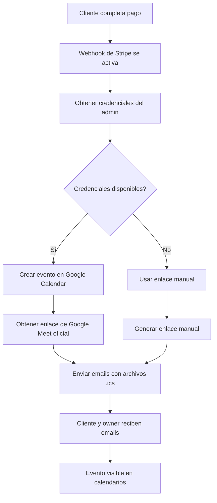

# 🧪 Guía de Pruebas - Google Calendar Integration

## ✅ **Integración Completada**

La integración con Google Calendar está completamente implementada y lista para probar.

## 🔧 **Archivos Creados/Modificados**

### **Nuevos Archivos:**
- `src/lib/google-calendar.ts` - Utilidades para crear eventos en Google Calendar
- `src/app/api/admin/google-calendar-credentials/route.ts` - API para manejar credenciales del admin
- `TESTING_GOOGLE_CALENDAR.md` - Esta guía de pruebas

### **Archivos Modificados:**
- `src/app/admin/GoogleCalendarSetup.tsx` - Guarda credenciales en el servidor
- `src/app/api/stripe/webhook/route.ts` - Usa Google Calendar real para crear eventos

## 🚀 **Cómo Probar la Integración Completa**

### **1. Configurar Variables de Entorno**

Asegúrate de tener en tu `.env.local`:
```env
GOOGLE_CLIENT_ID=tu-client-id.googleusercontent.com
GOOGLE_CLIENT_SECRET=tu-client-secret
NEXTAUTH_URL=http://localhost:3000
```

### **2. Conectar Google Calendar en Admin**

1. **Inicia el servidor:**
   ```bash
   npm run dev
   ```

2. **Ve al admin:**
   ```
   http://localhost:3000/admin
   ```

3. **Inicia sesión:**
   - Usuario: `admin`
   - Contraseña: `admin123`

4. **Conecta Google Calendar:**
   - Ve a la sección "📅 Configuración de Google Calendar"
   - Haz clic en "Conectar con Google Calendar"
   - Completa el proceso OAuth
   - Haz clic en "Probar Conexión" para verificar

### **3. Probar Flujo Completo del Cliente**

1. **Ve a la página principal:**
   ```
   http://localhost:3000
   ```

2. **Completa el chat con la IA:**
   - Responde las preguntas sobre tu situación
   - Selecciona el tipo de visa que necesitas

3. **Completa el formulario:**
   - Llena todos los campos requeridos
   - Selecciona fecha y hora disponibles
   - Procede al pago

4. **Usa tarjeta de prueba de Stripe:**
   - Número: `4242 4242 4242 4242`
   - Fecha: Cualquier fecha futura
   - CVC: Cualquier número de 3 dígitos

5. **Verifica los resultados:**
   - ✅ **Pago exitoso** → Redirección a página de éxito
   - ✅ **Owner recibe email** con archivo .ics y enlace de Google Meet
   - ✅ **Cliente recibe email** con archivo .ics y enlace de Google Meet
   - ✅ **Evento creado** en Google Calendar del owner
   - ✅ **Enlace de Google Meet oficial** (no generado manualmente)

## 🔍 **Qué Verificar**

### **En el Admin (Google Calendar):**
- [ ] Evento aparece en el calendario del owner
- [ ] Título correcto: "Consulta de Visa - TIPO - NOMBRE_CLIENTE"
- [ ] Fecha y hora correctas
- [ ] Cliente aparece como asistente
- [ ] Enlace de Google Meet funcional
- [ ] Recordatorio configurado para 15 minutos antes

### **En los Emails:**
- [ ] **Owner**: Email con archivo .ics adjunto
- [ ] **Cliente**: Email con archivo .ics adjunto
- [ ] **Ambos**: Enlace de Google Meet idéntico y funcional
- [ ] **Archivos .ics**: Se abren correctamente en calendarios

### **En los Logs del Servidor:**
```bash
# Deberías ver estos logs:
📅 Creando evento real en Google Calendar...
✅ Evento creado exitosamente en Google Calendar
🆔 ID del evento: [ID_DEL_EVENTO]
🔗 Enlace Meet oficial: [ENLACE_GOOGLE_MEET]
📧 Email de invitación al cliente enviado exitosamente!
📅 Archivo .ics generado y adjunto
```

## 🐛 **Solución de Problemas**

### **Error: "No hay credenciales de Google Calendar configuradas"**
- **Causa**: No has conectado Google Calendar en el admin
- **Solución**: Ve al admin y conecta Google Calendar

### **Error: "Las credenciales han expirado"**
- **Causa**: Los tokens de acceso han expirado
- **Solución**: Reconecta Google Calendar en el admin

### **Error: "Permisos insuficientes"**
- **Causa**: No se otorgaron todos los permisos necesarios
- **Solución**: Desconecta y vuelve a conectar Google Calendar

### **No se crea evento en Google Calendar**
- **Verifica**: Que las APIs estén habilitadas en Google Cloud Console
- **Verifica**: Que los URIs de redirección sean correctos
- **Verifica**: Que las credenciales OAuth sean válidas

### **Enlaces de Google Meet no funcionan**
- **Causa**: El evento no se creó correctamente en Google Calendar
- **Solución**: Verifica los logs del servidor para errores

## 🎯 **Flujo Esperado**



## 🚀 **Próximos Pasos**

Una vez que confirmes que todo funciona:

1. **Configurar en producción** con tu dominio real
2. **Agregar manejo de errores** más robusto
3. **Implementar base de datos** para credenciales persistentes
4. **Agregar notificaciones** de estado de conexión
5. **Implementar sincronización** bidireccional

---

**¡La integración está lista para usar!** 🎉

Prueba el flujo completo y verifica que todos los componentes funcionen correctamente.
